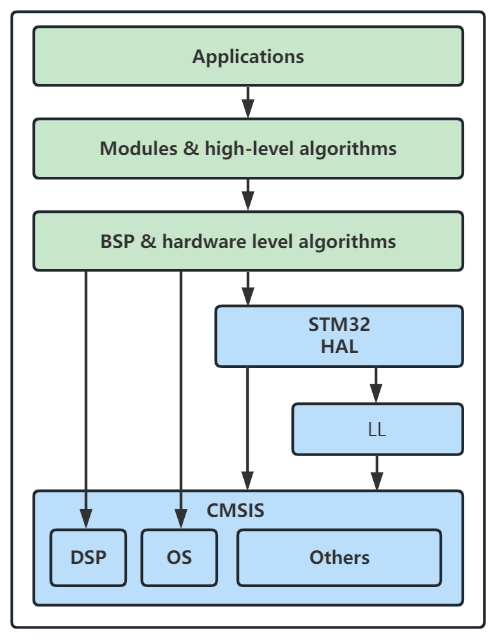
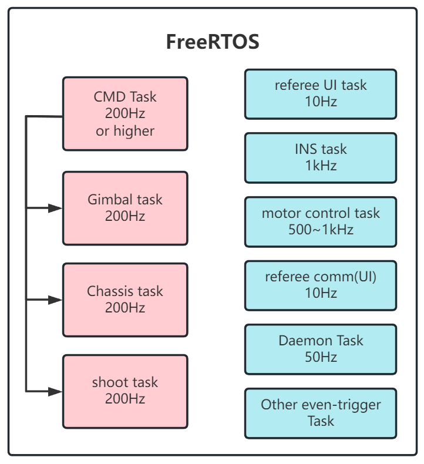
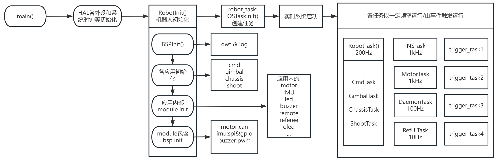
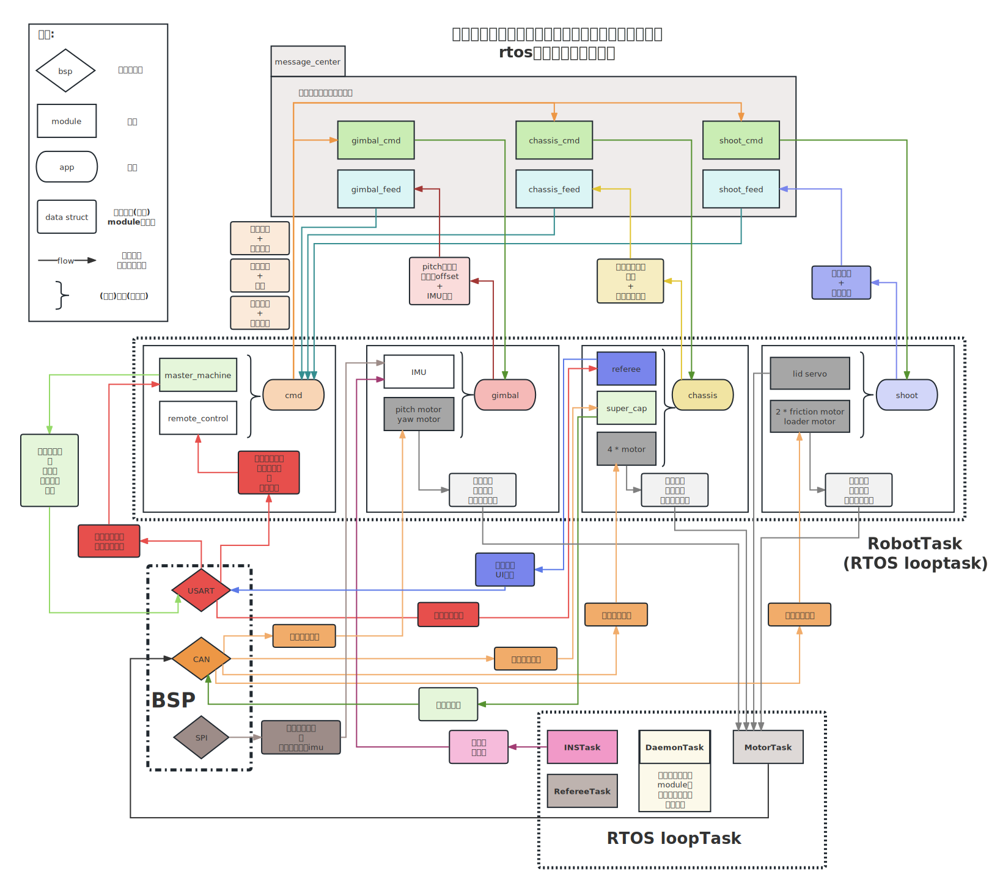

# 2023 EC basic-framework

> 每个bsp/module/application都有对应文档，建议阅读之后再看代码&进行开发。框架的搭建思路和讲解视频戳这里：[basic_framework讲解](https://www.bilibili.com/video/BV1Bd4y1E7CN)。
> 开发之前必看的文档：**README.md & VSCode+Ozone使用方法.md** 。开发app层请看application目录下的文档，若要开发module以及bsp务必把上层文档也浏览一遍以熟悉接口定义的方式。
> **程序的运行流程和框架所有app/module/bsp的数据流图直接拉到本文档底部。**

此框架为机器人通用设计，当前的app层是为步兵设计的。不同的机器人只需要重新编写应用层。在我们的战队仓库中有英雄、工程、哨兵、平衡步兵等兵种，可作参考。

此框架在RoboMaster A型开发板的移植也已在组织仓库中提供。

[TOC]

## 基本信息和开发规范

- **开发方式**：

  本框架使用stm32cubemx生成，基于makefile编译系统（后期拟修改为cmake+nijna+makefile以提高编译速度，对于目前的版本您可以考虑自行安装ccache以提高编译速度），使用arm gnu工具链开发，利用arm-none-eabi-gcc编译（make命令,命令行为mingw32-make）。

  > ***==！deprecated==***：若需使用keil5开发，请在stm32cubemx的`project manager`标签页下将工具链改为MDK，然后在keil中自行添加所需包含的.c文件和头文件。关于如何在keil下添加dsplib，请参考文档。在vscode中也有**KEIL assistant**和**Embedded IDE**插件可供使用。
  >
  > ***强烈推荐使用VSCode进行开发，Ozone进行调试。***

  VSCode可通过Cortex-Debug利用OpenOCD进行调试，jlink/stlink/dap-link都支持，具体的使用方法和环境配置教程在[VSCode+Ozone使用方法](./VSCode+Ozone使用方法.md)中。**请使用UTF-8编码查看\&编辑此项目**。
  **此外，本项目中使用到的物理变量值均采用标准单位制**，若有特殊需求，可以通过module层的`general_def.h`添加物理量转换关系的宏。

- **分层**：

  本框架主要代码分为**BSP、Module、APP**三层。三层的代码分别存放在同名的三个文件夹中，这三个文件夹存放在根目录下。开发过程中主要编写APP层代码，Module层与BSP层不建议修改。如需添加module（如oled屏幕、其他传感器和外设等），请按照规范编写并联系组长提交commit到dev分支或对应的功能名分支，完善后合并至主分支。在配置git的时候，将自己的`user.name`配置成英文缩写或易懂的nick name。

  BSP层构建于ST的HAL（硬件抽象层）之上，针对RoboMaster竞赛所用电控外设和模块的特点对其进行了进一步封装；Module层是基于bsp的封装打造的各种模块，旨在为app层提供**硬件无关的接口**，即应用层不应该出线任何与片上外设相关的代码。

  **main.c的位置在**`Src/main.c`

- **代码格式**：

  在vscode-设置-扩展-C/C++-C_Cpp:style下修改。默认为`Visual Studio`。编写完新的代码后，使用`右键-格式化`或`shift+alt+f`(请勿对cube生成的文件使用此操作否则重新生成异常)。此操作不会改变文档的内容，但会改变缩进、空行、符号位置等，使代码更加统一、整洁。

  **在cubemx生成的文件(尤其是main.c和freertos.c)时,务必按照cubemx的提示将用户代码放在usercode注释代码块内,否则重新生成时会被覆盖.**

  请保持良好的注释编写习惯，建议安装doxygen插件。务必统一在.h文件中为外部接口编写注释，并给类型定义编写必要的注释。对于私有函数（.c文件中static修饰），请在.c文件中进行注释。对于复杂的代码段，也请添加注释。

  每个功能模块编写完之后，及时添加说明文档。内容参照已有的文档，要进行简短的**总体说明、代码结构、外部接口和类型定义、私有函数和变量，以及使用的说明和范例**。如果有特别需要注意的地方，也请说明。

  ==**在编写代码的时候，注意添加安全检查，“treat your users as idiots！”**==

- **面向对象设计**：

  C语言不存在“成员函数”的概念。为实现类似效果，所有按照这一思想构建的函数都会有一个传入参数，将结构体（对象）传入。

- **代码风格：**

  函数统一使用**动宾短语**，建议不超过4个单词。每个单词首字母大写：

  ```c
  void SetMotorControl()
  ```

  变量命名使用下划线命名法，统一小写。尽量不要使用缩写，并注意让变量名本身能够表达其含义：

  ```c
  uint8_t gimbal_recv_cmd;
  ```

  后续可能将指针类型的变量名都加上`ptr_`或`p`前缀。私有变量加上下划线`_`前缀。

  在利用`typedef`定义新的类型时，使用单词首字母大写+下划线隔开+定义后缀的方式：

  ```c
  typedef struct
  {
      float Accel[3];
      float Gyro[3];
  } IMU_Data_t;
  
  typedef struct
  {
      can_instance_config_s can_config;
      uint8_t send_data_len;
      uint8_t recv_data_len;
  } CANComm_Init_Config_s;
  
  typedef struct
  {
      float *other_angle_feedback_ptr;
      float *other_speed_feedback_ptr;
  
      PID_t current_PID;
      PID_t speed_PID;
      PID_t angle_PID;
  
      float pid_ref; // 将会作为每个环的输入和输出顺次通过串级闭环
  } Motor_Controller_s;
  ```

  数据类型单一、结构不复杂的类型以`_t`后缀结尾（表明这是一种数据，type）；复杂的结构体类型使用`_s`结尾，表明其功能和内涵多（structure）。对于某个bsp、module，其类型结构体应该称为`xxxInstance`:
  
  ```c
  typedef struct _
  {
      CAN_HandleTypeDef *can_handle; // can句柄
      CAN_TxHeaderTypeDef txconf;    // CAN报文发送配置
      uint32_t tx_id;                // 发送id
      uint32_t tx_mailbox;           // CAN消息填入的邮箱号
      uint8_t tx_buff[8];            // 发送缓存,最大为8
      uint8_t rx_buff[8];            // 接收缓存
      uint32_t rx_id;                // 接收id
      uint8_t rx_len;                // 接收长度,可能为0-8
      // 接收的回调函数,用于解析接收到的数据
      void (*can_module_callback)(struct _ *); // callback needs an instance to tell among registered ones
  } CANInstance;
  ```
  
## BSP层(Board Sopport Package)

- 主要功能：实现对STM HAL的封装功能，进一步抽象硬件。
  - 在本框架中，BSP层与cubeMX初始化有一定程度的耦合，若没有在CUBEMX中开启某个外设，则在application不能初始化使用了对应外设的module。对该层的修改可能需要使用cube重新生成工程（主要是外设的配置，通信速度，时钟频率和分频数等）。该层也是唯一允许直接出现stm32HAL库函数的代码层，**在非BSP层编写代码时，如需使用HAL_...函数，请思考是否有同功能的BSP_...函数**。不过，由于ST的HAL已经对硬件进行较高的抽象（如以handle_xxx的方式描述一个硬件外设或功能引脚），因此即使需要更换开发板，必须修改的内容也极少。
  - 最简单的(如gpio)仅是对HAL库函数的封装。较为复杂的则会进行一定程度的处理(如can)

**编写和使用指南**

- 补充与修改：某款主控对应的BSP层应保持相同，当认为该层可能缺少部分功能或有错误时，请联系组长确认后解决并更新整个框架，**请勿自行修改提交**。 请在你修改/增加的bsp_XXX.md中提供测试用例和使用示范以及任何其他需要注意的事项，并在代码必要的地方添加注释。
- 代码移植：BSP层也是在不同系列、型号的stm32间执行代码移植时主要需要关注的代码层。向功能更强系列移植一般只需要重配cube，而向功能较少的系列移植还需要去掉其不支持的功能。如果仅是对同一型号的开发板进行CUBEMX初始化配置的修改，一般只需要给app层的应用重新分配外设和引脚，或修改波特率和通信频率等。
- 子文件与文件夹：
  - bsp.c/h：该层用于bsp基础功能初始化的文件，其中`bsp.h`被include至main.c中，以实现必须的底层初始化，目前需要初始化的bsp只有log和dwt，**不同主频的MCU需要修改dwt初始化的参数**。**注意**，有些外设如串口和CAN不需要在bsp.c中进行模块层的初始化，他们会在module层生成实例（即C语言中的结构体）并注册到bsp层时自动进行初始化。以此达到提高运行速度避免未使用的模块被加载的问题。
  - bsp_xxx.c/h：每一个成对的.c/h对应一种外设，当上面两个代码层需要使用某个外设时，这里的文件就是对应的交互接口。
- 注册回调函数与接收：通信类外设模块有的定义了回调函数(函数指针类型)，module层的模块需要自行处理接收回调函数，在注册bsp的时候应传入对应参数格式的回调函数指针，使得接收中断发生的时候bsp层可以自行找到对应的上层回调函数进行调用。这也是回调函数设计的初衷：为底层代码调用上层代码提供接口，当特定事件发生的时候完成触发（自行搜索hook函数）。

## Module层

- 主要功能：实现对设备的封装，如将IMU、PC、电机等视为一个完整的功能模块，让应用层（app）不需要关心其底层的具体实现，直接使用接口。

- 文件夹

  - **注意，module层没有也不需要进行统一初始化**。app层的应用会包含一些模块，因此由app来调用各个模块的init()或register()函数，只有当一个module被app实例化，这个模块才会存在。

    > ~~命名为init()的初始化一般来说是开发板的独占资源，即有且只有一个这样的模块，无法拥有多个实例，如板载陀螺仪、LED、按键等。命名为register()的模块则可以拥有多个，比如电机。~~ legacy support，为了保证代码风格统一，所有接口统一命名为xxxRegister()。

  - algorithm:该层软件库存放位置，这些功能与硬件无关，而是提供通用的数据结构和“算子”以供该层的其他部分调用，主要是算法、控制器、底盘和位姿解算等。

- module编写和使用指南：

  - 初始化：

    根据代码对应的函数说明，传入对应的配置文件。对于某些需要集中设置的参数，一般于模块的头文件中会额外设定一个xxx_config_s的结构体用于初始化的参数传递。如果不需要进行这样的集中设置，则是直接传入对应的参数或module结构体中本就存在的成员变量。

  - 结构体：

    也就是所说的“实例”，定义一个module结构体，对于app层来说就是拥有某一个功能模块的实例，比如一个特定的电机。在对电机进行操作的时候，为实现面向对象的功能，需要在接口函数中传入该结构体指针。

  - 函数：

    .c中存放的static函数和static变量相当于这个类的private函数，.h中的则相当于public。相似的driver的public函数应较为统一。由于通信格式，使用方法等的不同，不同通信设备在读取操作、数据格式上可能有所不同，这些不同应该在driver的内部处理。**由于C语言没有对象的概念，对于通信类的module，不同的实例需要在module.c中保存一份指针，用于处理数据接收的解析。**

  - 封装程度：

    app层使用时与底层实现无关。如在使用电机时，这个电机的数据该和哪些电机的数据在一个数据包中发送，can的过滤器设置，均属于应该自动处理的功能；通信类的模块应该封装到只有初始化、发送和读取。对于电机，则是用于初始化的`register`和发送控制命令`set_control`两个函数和一个实时更新的用于给app层提供该信息的数据结构体（电机反馈信息）。

Module层主要存放的是类型定义和实例指针数组，在该层没有进行实例化（定义或通过malloc分配空间），若在APP层没有实例化，则该模块的存在与否不会影响编译后的可执行文件，只会占用.c文件中的static变量和代码区的少量内存（有些module只会保存每个实例对象的指针，在没有初始化的时候仅仅占用一个指针数组的空间）。因此，基于本框架的其他工程没有必要删除APP层未使用的module文件。

务必为模块添加说明文档和使用范例，以及其他需要注意的事项（如果有）。

> **面向对象小指南：**
>
> 由于C语言没有对象的概念，对于需要使用通信的module，在其.c文件下都需要保存每个实例的指针，在收到消息时(发生回调)遍历所有实例指针，找到收到消息的实例。这种处理方式可能会导致实时性下降，例如CAN接收时要遍历所有注册了CAN的实例，进入module层还需要一次遍历。用C++则可以将对象的this指针和模块的回调函数进行绑定，生成一个可调用对象然后再进行CAN的注册，使得其不需要module层的遍历。
>
> 考虑在实例中加入一个额外的`void*`域成员（成员变量），其内容为module层实例的地址。这样CAN收到消息时只需要遍历所有CAN instance，对于相同的模块，可以在其回调函数内部获取CAN instance的`void*`指针并通过强制类型转换cast成模块的实例结构体指针类型，从而访问特定的模块。
> 这实际上是保存“对象”的parent pointer，使得实例可以访问拥有自己的实例（访问自己的父亲）。和回调函数配合，就可以防止交叉包含并为底层访问上层内容提供支持。

## APP层(application)

- 功能：实现机器人的控制，对机器人**控制**结构进行抽象。

 在完成BSP层和Module层后，如果在APP层没有控制代码，则代码并无实际功能。换言之，BSP层与Module层的存在是为了APP层更简单、更合理、更易于扩展和移植。本框架的初始目标即是实现：在APP层仅需思考逻辑并用无关硬件的C语言代码实现即可完成整个机器人的控制。所有需要使用的模块和算法都在Module层提供，开发板外设硬件的抽象在bsp层完成。**所有使用到的模块都在APP层初始化**，因此不需要module自行初始化。

- APP层按照机械设计结构（如云台、发射、底盘、夹爪、抬升、机械臂）建立对应的子文件夹，在其中完成初始化和相关逻辑功能的编写。还有用于发布指令的云台指令应用和底盘指令应用，前者应该包含一个遥控器模块和一个视觉通信模块，后者包含裁判系统模块。它们包含的模块都会处理一些指令和控制信息，这样还可以方便兼容双板。

- 单双板切换在application的`robot_def.h`中进行，**修改宏定义可以切换开发板的设定模式**。当设定为单板的时候，在`robot.c`中会对gimbal，chassis，shoot，robot_cmd四个应用都进行初始化。对于双板的情况，需要将上板配置为gimbal board，下板配置为chassis board，它们会分别初始化gimbal/shoot/robot_cmd和chassis

- 对于单板的情况，所有应用之间的信息交互通过message center完成。而使用双板时，需要通过板间通信传递控制信息（默认遥控器接收机和pc在云台板，裁判系统在底盘板，因此需要互发信息）。当前通过**条件编译**来控制信息的去向（发往message center/接收，还是通过can comm发送/接收），后续考虑将双板通信纳入message center的实现中，根据`robot_def.h`的开发板定义自动处理通信，降低应用层级的逻辑复杂度。

## 文件树

板级支持包的每个组件,每个moduel,以及每个app都有对应的说明文档.

```shell
ROOT:.
│  .gitignore # git版本管理忽略文件
│  .mxproject # CubeMX项目文件
│  basic_framework.ioc # CubeMX初始化配置文件
│  debug_ozone.jdebug # ozone debug调试配置和缓存文件
│  LICENSE # 开源协议文件
│  Makefile # 编译管理文件,为make(mingw32-make)命令的目标
│  openocd_dap.cfg # 用于OpenOCD调试使用的配置文件,dap用
│  openocd_jlink.cfg # 用于OpenOCD调试使用的配置文件,jlink用
│  README.md # 本说明文档
│  startup_stm32f407xx.s  # F407汇编启动文件
│  stm32.jflash # jlink的烧录的配置文件,一键下载用
│  STM32F407.svd # F407外设地址映射文件,用于调试
│  STM32F407IGHx_FLASH.ld # F407IGH(C板MCU)目标FLASH地址和链接规则,用于编译(作为链接阶段的链接器)
│  task.ps1 # powershell脚本,一键编译并进入ozone调试/reset开发板用
│  TODO.md # 项目待完成的任务
│  VSCode+Ozone使用方法.md # 开发环境配置和前置知识介绍
│  修改HAL配置时文件目录的更改.md # 重新配置CubeMX时的步骤和注意事项
│  必须做&禁止做.md # 开发必看,规范和要求
│  如何定位bug.md # 开发必看,快速定位bug并进行修复.还提供了一些debug典例
│
├─.vscode
│      launch.json # 调试的配置文件
│      settings.json # 工作区配置文件,根据自己的需要配置
│      tasks.json # 任务配置文件,包括一键编译下载调试等
│
├─.assets # 说明文档的图片
├─application # 应用层
├─bsp # 板级支持包
├─modules # 模块层
│
├─Src #hal生成的外设初始化源文件
├─Inc #hal生成的外设初始化头文件
├─Drivers #hal driver和cmsis drivers
└─Middlewares # STusb ext , rtos , segger rtt等
```

## BSP/Module/Application介绍

在对应应用、模块和板级支持包文件夹下。每个.c文件或完整的功能模块都有说明文档。在编写新代码时注意按照规范编写说明文档。

## 整体架构

### 软件分层



### 运行任务



### 初始化流程

~~~mermaid
graph TD
HAL库初始化 --> BSP初始化 --> Application初始化 --> app调用其拥有模块的初始化 --> 启动操作系统
~~~

**注意，应用初始化不得放入其对应任务中，即使是在死循环前，否则可能导致一些需要定时器的任务初始化异常**。

APP会调用其所有的模块的初始化函数（注册函数），这是因为本框架的设计思想是任何模块在被注册（构造/初始化）之前，都是不存在的，当且仅当定义了一个模块结构体（也称实例）的时候，才有一个实体的概念。

main函数唯一需要的函数是app层的`robot.c`中的`RobotInit()`函数，它首先会调用BSP初始化，然后进行所有应用的初始化；每个应用会调用对应模块的初始化；一些依赖通信外设的模块会将通信支持相关的bsp进行初始化。初始化结束之后实时系统启动。

### 程序运行流程



### 程序数据流


