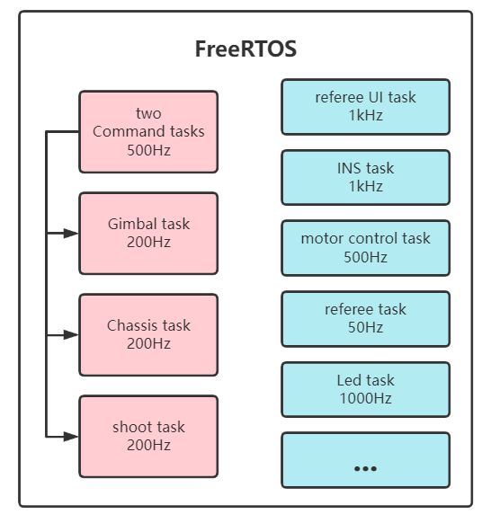

# 2023 EC-basic-framework（C语言版）说明

当前版本更新日期：2022.11.03

本说明仅针对电控组2023赛季框架，如有变动以日期靠后的版本为准。**==由于当前仍然处在测试开发阶段，请定期拉取（`git pull`）获取最新更新。==**

- 开发方式：

  本框架使用stm32cubemx生成，基于makefile，使用gcc-arm-none-eabi编译（make命令）。

  > ！deprecated：若需使用keil5开发，请在stm32cubemx的`project manager`标签页下将工具链改为MDK，然后在keil中自行添加所需包含的.c文件和头文件。关于如何在keil下添加dsplib，请参考文档。
  >
  > ***强烈推荐使用VSCode进行开发，Ozone进行调试。***

  VSCode可通过Cortex-Debug利用OpenOCD进行调试，jlink/stlink/dap-link都支持，具体的使用方法和环境配置教程在[VSCode+Ozone使用方法](./VSCode+Ozone使用方法.md)中。

  推荐使用 **SEGGER ozone** 进行调试。

- 分层：

  本框架主要代码分为**BSP、Module、APP**三层。三层的代码分别存放在同名的三个文件夹中，这三个文件夹存放在根目录下。开发过程中主要编写APP层代码，Module层与BSP层不建议修改。如需添加module（如oled屏幕、其他传感器和外设等），请按照规范编写并联系组长提交commit到dev分支，完善后合并至主分支。在配置git的时候，将自己的`user.name`配置成英文缩写或易懂的nick name。

  BSP层构建与HAL之上。HAL库和实时系统、DSP支持等文件都在`HAL_N_Middlewares`文件夹下（包括Cube生成的外设初始化的Inc和Src文件夹）。

  **main.c的位置在**`HAL_N_Middlewares/Src/main.c`

- 代码格式：

  在vscode-设置-扩展-C/C++-C_Cpp:style下修改。默认为`Visual Studio`。编写完新的代码后，使用右键-格式化文档(注：请勿对cube生成的文件使用此操作)。此操作不会改变文档的内容，但会改变缩进、空行、符号位置等，使代码更加统一、整洁。

  请保持良好的注释编写习惯，建议安装doxygen插件。务必统一在.h文件中为外部接口编写注释，并给类型定义编写必要的注释。对于私有函数（.c文件中static修饰），请在.c文件中进行注释。对于复杂的代码段，也请添加注释。

  每个功能模块编写完之后，及时添加说明文档。内容参照已有的文档，要进行简短的**总体说明、代码结构、外部接口和类型定义、私有函数和变量，以及使用的说明和范例**。如果有特别需要注意的地方，也请说明。

  ==**在编写代码的时候，注意添加安全检查，“treat your users as idiot！”**==

- 面向对象设计：

  C语言不存在“成员函数”的概念。为实现类似效果，所有按照这一思想构建的函数都会有一个传入参数，将结构体（对象）传入。

## BSP层(Board Sopport Package)

- TODO：
  1. 增加SPI和I^2^C的BSP模组以便支持IST384磁力计和Oled显示屏等。
  1. 增加和module层的deteck_task配合的蜂鸣器和led闪烁配置。
- 主要功能：实现映射功能。
  - 在本框架中，BSP层与cube高度耦合，对该层的修改可能需要使用cube重新生成工程（主要是外设的配置，通信速度，时钟频率和分频数等）。该层也是唯一允许直接出现stm32HAL库函数的代码层，**在非BSP层编写代码时，如需使用HAL_...函数，请思考是否有同功能的BSP_...函数**。不过，由于ST的HAL已经对硬件进行较高的抽象（如以handle_xxx的方式描述一个硬件外设或功能引脚），因此更换开发板需要修改的内容极少。
  - 最简单的(如gpio)仅是对HAL库函数的封装。较为复杂的则会进行一定程度的处理(如can)
- 补充与修改：某款主控对应的BSP层应保持相同，当认为该层可能缺少部分功能或有错误时，请联系组长确认后解决并更新整个框架，**请勿自行修改**。
- 代码移植：BSP层也是在不同系列、型号的stm32间执行代码移植时主要需要关注的代码层。向功能更强系列移植一般只需要重配cube并重新组织BSP层的映射关系，而向功能较少的系列移植还需要去掉其不支持的功能。修改BSP后一般不需要对其他两层进行修改。
- 子文件与文件夹：
  - bsp.c/h：该层核心文件，其中.h被include至main.c中，以实现整个代码层的初始化。include了该层所有模块的.h并调用各模块的初始化函数。**注意**，有些外设如串口和CAN不需要在bsp.c中进行模块层的初始化，他们会在module层生成实例（即C语言中的结构体）并注册到bsp层时自动进行初始化。以此达到提高运行速度避免未使用的模块被加载的问题。
  - bsp_xxx.c/h：每一个成对的.c/h对应一种外设，当上面两个代码层需要使用某个外设时，这里的文件就是对应的交互接口。
- 注册回调函数与接收：通信类外设模块有的定义了回调函数类型(函数指针类型)，若调用bsp...h中的回调函数注册函数将其他位置(HAL层)定义的符合形式的函数注册为回调函数，该函数在接收到数据后或其他设定位置会被调用。在module对模块进行初始化的时候需要将对应的协议解析函数进行设置，代码中注释有对应提示。

## Module层

- TODO：

  1. 增加模块离线/错误检测模块（官方例程中的`deteck_task`）。
  2. 增加超级电容模块
  3. 增加步进电机模块
  4. 增加裁判系统多机通信、UI绘制模块
  5. 增加舵机模块
  6. 增加单点激光模块
  
- 主要功能：实现对设备的封装，如将IMU、PC、电机等视为一个完整的功能模块，让应用层不需要关心其底层的具体实现，直接使用接口。

- 子文件与子文件夹

  - **注意，module层没有也不需要进行同意初始化**。app层的应用会包含一些模块，因此由app来调用各个模块的init或register函数，只有当一个module被app实例化，这个模块才会存在。

    > 命名为init()的初始化一般来说是开发板的独占资源，即有且只有一个这样的模块，无法拥有多个实例，如板载陀螺仪、LED、按键等。命名为register()的模块则可以拥有多个，比如电机。

  - monitor文件夹:实现看门狗功能。提供回调函数和count可选（TODO）

  - algorithm:该层软件库存放位置，这些功能与硬件无关，而是提供通用的数据结构和“算子”以供该层的其他部分调用，主要是算法、控制器、底盘和位姿解算等。

- module要点：

  - 初始化：

    根据代码对应的函数说明，传入对应的配置文件。对于某些需要集中设置的参数，一般于模块的头文件中会额外设定一个xxx_config_s的结构体用于初始化的参数传递。如果不需要进行这样的集中设置，则是直接传入对应的参数或module结构体中本就存在的成员变量。

  - 结构体：

    也就是所说的“实例”，定义一个module结构体，对于app层来说就是拥有某一个功能模块的实例，比如一个特定的电机。在对电机进行操作的时候，传入该结构体指针。

  - 函数：

    .c中存放的static函数和static变量相当于这个类的private函数，.h中的则相当于public。相似的driver的public函数应较为统一。由于通信格式，使用方法等的不同，不同通信设备在读取操作、数据格式上可能有所不同，这些不同应该在driver的内部处理。**由于C语言没有对象的概念，对于通信类的module，不同的实例需要在module.c中保存一份指针，用于处理数据接收的解析。**

  - 封装程度：

    应尽可能使到上层使用时不考虑下层所需的操作。如在使用电机时，这个电机的数据该和哪些电机的数据在一个数据包中发送，can的过滤器设置，均属于应该自动处理的功能；
    接收类的driver应该封装到只有初始化（用于初始化的`register`和发送控制命令`set_control`两个函数和一个实时更新的用于给app层提供该信息的数据结构体）。

Module层主要存放的是类型定义和实例指针数组，在该层没有进行实例化（定义或通过malloc分配空间），若在APP层没有实例化，则该模块的存在与否基本不会影响编译后的可执行文件，只会占用初始化和代码区所需的少量内存。module只会保存每个实例对象的指针，在没有初始化的时候仅仅占用一个指针数组的空间。因此，基于本框架的其他工程没有必要删除APP层未使用的module文件。

> **待优化：**
>
> 由于C语言没有对象的概念，对于需要使用通信的module，在其.c文件下都需要保存每个实例的指针，在收到消息时遍历所有实例指针，找到收到消息的实例。这种处理方式可能会导致实时性下降，CAN接收时要遍历所有注册了CAN的实例，进入module层还需要一次遍历。用C++则可以将对象的this指针和模块的回调函数进行绑定，生成一个可调用对象然后再进行CAN的注册，使得其不需要module层的遍历。
>
> 后续考虑在CAN instance中加入一个额外的`void*`域成员（成员变量），其内容为module层实例的地址。这样CAN收到消息时只需要遍历所有CAN instance，对于相同的模块，可以在其回调函数内部获取CAN instance的`void*`指针并通过强制类型转换cast成模块的实例结构体指针类型，从而访问特定的模块。

## APP层(application)

  - TODO：
    1. 完成麦克纳姆轮/全向轮底盘的功能
    2. 完成发射应用
    3. 完成云台控制应用
    4. 增加机器人整车控制应用
  - 主要功能：实现机器人的控制

 在完成BSP层和Module层后，如果在APP层没有控制代码，则代码并无实际功能。换言之，BSP层与Module层的存在是为了APP层更简单、更合理、更易于扩展和移植。本框架的初始目标即是实现：在APP层仅需思考逻辑并用无关硬件的C语言代码实现即可完成整个机器人的控制。所有需要使用的模块和算法都在Module层提供。

  - APP层按照模块（如云台、发射、底盘）建立对应的子文件夹，在其中完成初始化和相关逻辑功能的编写。还有用于发布指令的云台指令应用和底盘指令应用，前者应该包含一个遥控器模块和一个视觉通信模块，后者包含裁判系统模块。它们包含的模块都会处理一些指令和控制信息，因此将这两个应用从云台和底盘应用中隔离出来。这样还可以方便兼容双板。

  - 单双板切换在application的`robot_def.h`中进行，修改宏定义可以切换开发板的设定模式。当设定为单板的时候，在`robot.c`中会对gimbal，chassis，shoot，gimbal_cmd，chassis_cmd五个应用都进行初始化。对于双板的情况，需要将上板配置为gimbal board，下板配置为chassis board，它们会分别初始化gimbal/shoot/gimbal_cmd和chassis/chassis_cmd。

  - 对于单板的情况，所有应用之间的信息交互通过message center完成。而使用双板时，需要通过板间通信传递控制信息（默认遥控器接收机和pc在云台板，裁判系统在底盘板，因此需要互发信息）。当前通过**条件编译**来控制信息的去向（发往message center/接收，还是通过can comm发送/接收），后续考虑将双板通信纳入message center的实现中，根据`robot_def.h`的开发板定义自动处理通信，降低应用层级的逻辑复杂度。

    

## 文件树

板级支持包的每个组件,每个moduel,每个app都有对应的说明文档.
```shell
ROOT:.
│  .gitignore             # git版本管理忽略文件
│  .mxproject			  # CubeMX项目文件
│  basic_framework.ioc	  # CubeMX初始化配置文件
│  Makefile               # 编译管理文件,为make(mingw32-make)命令的目标
│  openocd_dap.cfg		  # 用于OpenOCD调试使用的配置文件
│  openocd_jlink.cfg	  # 同上
│  README.md              # 本说明文档
│  startup_stm32f407xx.s  # F407汇编启动文件
│  STM32F407.svd          # F407外设地址映射文件,用于调试 
│  STM32F407IGHx_FLASH.ld # F407IGH(C板使用的MCU)的文件目标FLASH地址,用于烧录和调试
│  VSCode+Ozone使用方法.md # 开发环境配置和前置知识介绍
|
├─.vscode       
│      launch.json  # 用于VSCode插件CORTEX-DEBUG调试的配置文件
│      settings.json# 工作区配置文件,设置了代码缩进和format风格等
│      tasks.json   # 启动编译的任务配置文件
├─assets # markdown存放图片和外链文件夹
|
├─application
│  │  application.md
│  │  APP层应用编写指引.md
│  │  robot.c
│  │  robot.h
│  │  robot_def.h
│  │
│  ├─chassis
│  │      chassis.c
│  │      chassis.h
│  │      chassis.md
│  │
│  ├─cmd
│  │      chassis_cmd.c
│  │      chassis_cmd.h
│  │      gimbal_cmd.c
│  │      gimbal_cmd.h
│  │
│  ├─gimbal
│  │      gimbal.c
│  │      gimbal.h
│  │      gimbal.md
│  │
│  └─shoot
│          shoot.c
│          shoot.h
│          shoot.md
│
├─bsp  # 板级支持包,提供对硬件的封装,将接口暴露给module层
│      bsp.md
│      bsp_buzzer.c
│      bsp_buzzer.h
│      bsp_can.c
│      bsp_can.h
│      bsp_can.md
│      bsp_dwt.c
│      bsp_dwt.h
│      bsp_init.c # bsp初始化
│      bsp_init.h
│      bsp_led.c
│      bsp_led.h
│      bsp_log.c
│      bsp_log.h
│      bsp_log.md
│      bsp_temperature.c
│      bsp_temperature.h
│      bsp_usart.c
│      bsp_usart.h
│      bsp_usart.md
│
|
├─HAL_N_Middlewares # HAL库对寄存器操作的封装,以及FreeRTOS/Segger RTT等中间件
|
|
└─modules  # 模块层,使用BSP提供的接口构建对应的功能模块,将模块实例提供给应用层
	|   module.md
	|
    ├─algorithm # 算法
    │      algorithm.md
    │      controller.c # 控制器
    │      controller.h
    │      crc16.c		# 循环冗余校验
    │      crc16.h
    │      crc8.c
    │      crc8.h
    │      kalman_filter.c # KF
    │      kalman_filter.h
    │      LQR.c           # LQR控制器
    │      LQR.h
    │      QuaternionEKF.c # 四元数EKF融合
    │      QuaternionEKF.h
    │      user_lib.c      # 多个模块都会使用到的函数
    │      user_lib.h
    │
    ├─can_comm # 双板CAN通信组件
    │      can_comm.c
    │      can_comm.h
    │      can_comm.md   
    | 
    ├─imu  # 考虑到使用SPI的设备较少,这里没有对SPI提供bsp支持,直接于此实现
    │      BMI088driver.c
    │      BMI088driver.h
    │      BMI088Middleware.c
    │      BMI088Middleware.h
    │      BMI088reg.h
    │      ins_task.c # 姿态解算任务,在RTOS中以1kHz运行
    │      ins_task.h
    │
    ├─led_light
    │      led_task.c # 用于指示错误和主控是否正常运行,流水灯任务
    │      led_task.h
    │
    ├─master_machine # 和上位机(视觉PC)通信的模块
    │      master_process.c
    │      master_process.h
    │      master_process.md 
    │      seasky_protocol.c 
    │      seasky_protocol.h
    │      湖南大学RoboMaster电控组通信协议.md
    │
    ├─message_center # 发布-订阅机制,app层应用之间交换数据用
    │      message_center.c
    │      message_center.h
    │      message_center.md
    |
    ├─motor # 电机模块
    │      dji_motor.c  # DJI智能电机
    │      dji_motor.h
    │      HT04.c       # 海泰-04关节电机
    │      HT04.h
    │      LK9025.c     # 瓴控9025驱动轮电机
    │      LK9025.h
    │      motor_def.h  # 电机通用定义
    │      motor_task.c # 电机控制任务,1kHz运行在RTOS上
    │      motor_task.h
    │
    ├─referee # 裁判系统模块
    │      referee.c # 接收裁判系统信息
    │      referee.h
    │      referee_UI.c # UI绘制(发送)
    │      referee_communication.c # 多机通信
    |
    ├─remote # 遥控器模块
    │      remote_control.c
    │      remote_control.h
    │
    └─super_cap # 超级电容
           super_cap.c
           super_cap.h
    	   super_cap.md
```

## BSP/Module/Application介绍

在对应应用、模块和板级支持包文件夹下。

## 整体架构

### 软件分层


### 运行任务



### 初始化流程

~~~mermaid
graph TD
HAL库初始化 --> BSP初始化 --> Application初始化 --> app调用其拥有模块的初始化 --> 启动操作系统
~~~

**注意，应用初始化不得放入其对应任务中，即使是在死循环前，否则可能导致一些需要定时器的任务初始化异常**。

APP会调用其所有的模块的初始化函数（注册函数），这是因为本框架的设计思想是任何模块在被注册（构造/初始化）之前，都是不存在的，当且仅当定义了一个模块结构体（也称实例）的时候，才有一个实体的概念。

main函数唯一需要的函数是app层的`robot.c`中的`RobotInitia()`函数，它首先会调用BSP初始化，然后进行所有应用的初始化；每个应用会调用对应模块的初始化；一些依赖通信外设的模块会将通信支持相关的bsp进行初始化。初始化结束之后实时系统启动。


> **代码参考了哈工深南宫小樱战队的框架设计，在此鸣谢。**