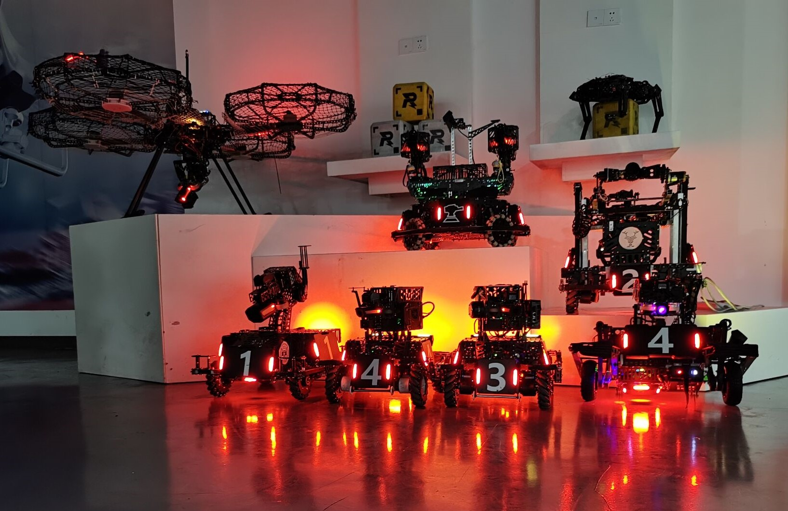
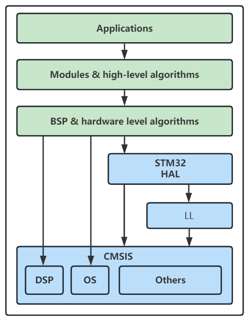
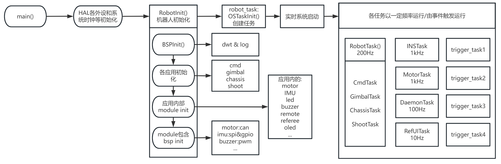
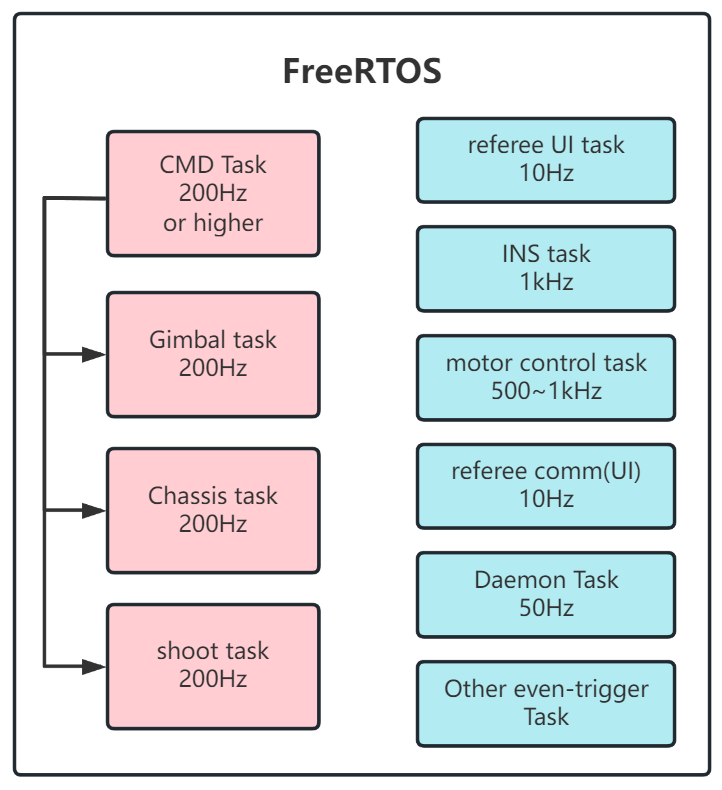
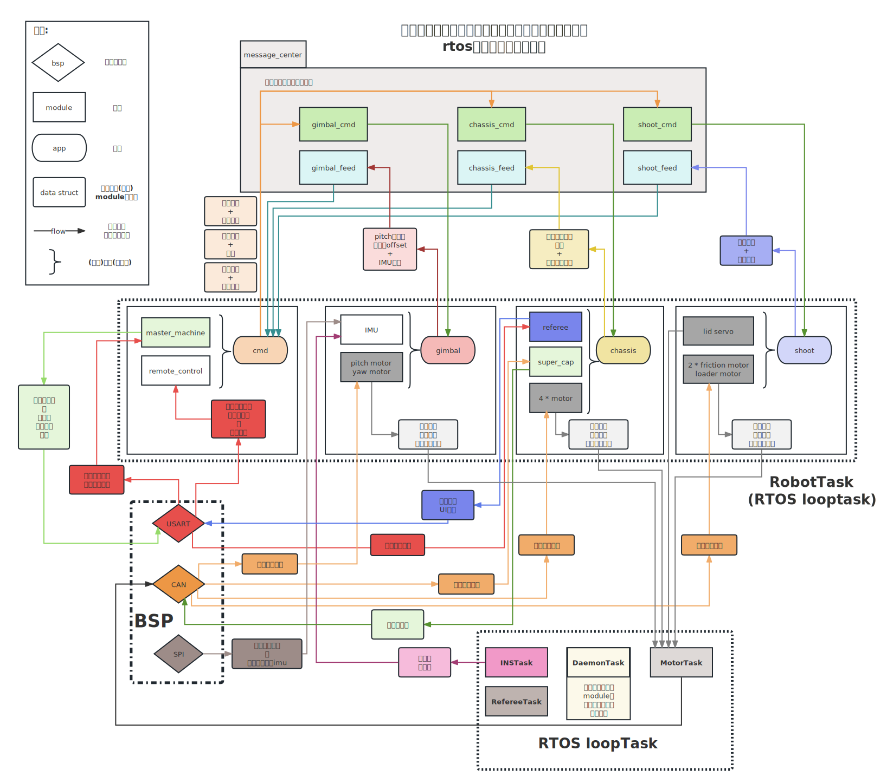
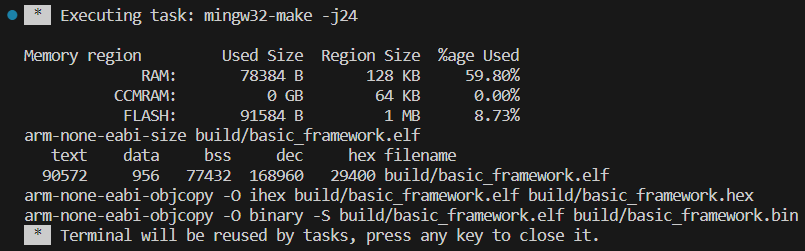

# YueLu2022/2023 EC basic_framework-dev

湖南大学RoboMaster跃鹿战队2022-2023电控通用嵌入式框架。

	
	

		
		
    	
    

   	

		
		
	

    <h5>
Best RoboMaster embedded EC open-source code ever?
</h>

> ***也许不是最好的？但一定是最完整最详细最适合上手的电控开源！***

[TOC]

***==别忘了仓库根目录下的`.Doc`文件夹中有关于配置环境和开发更详尽的说明！==***

- 若无法访问github，戳[gitee仓库](https://gitee.com/hnuyuelurm/basic_framework)
- 若gitee内容被屏蔽，戳[github仓库](https://github.com/HNUYueLuRM/basic_framework)

> 基于basic_framework打造的C++进阶重构版本[***powerful_framework***](https://gitee.com/hnuyuelurm/powerful_framework)现已发布！增加全新的消息交互机制和严格的跨任务数据读写保护，采用了现代构建系统CMake+Ninja以追求极致的编译速度，各种针对嵌入式的编译优化全开，DIY程度进一步提升，更有自定义CMSIS-DSP和Eigen等扩展库支持！快来加入试用/和我们一起开发吧😋

---

## 功能介绍和展示

### 起源

这是湖南大学RoboMaster跃鹿战队电控组2022-2023赛季的通用嵌入式控制框架，可用于**机器人主控**、自研模组（imu/测距等各种传感器）、超级电容控制器等。

从目前的RoboMaster开源社区来看，大部分队伍都没有一套规则统一，符合较大规模软件开发原则的框架，有些学校连不同兵种代码都相去甚远，甚至连队伍用于传承的代码注释都寥寥无几，全靠师傅带徒弟言传身教。当然，不乏有广东工业大学DynamicX开源的rm_control这样规范且先进的系统，但基于Linux、ROS、C++的这套软件栈对于新人来说还是过于复杂（但我们很推荐熟悉基本工具的同学使用！）。

### 优势

为此，basic_framework应运而生。该框架旨在打造上手简单、易于移植、高代码复用、层级分明、结构清晰的一套SDK，供队内使用&RM参赛队伍&嵌入式开发者交流学习。通过精心设计的bsp和module支持以及成熟的app示例，该框架可以在短时间内为不同类型和结构的机器人**轻松构建**电控程序，**可扩展性**和**可维护性**相较目前的大部分开源代码和本队的老代码提升巨大。

同时，相较于传统的基于KEIL MDK开发的工作流，我们推出了基于arm-gnu工具链+VSCode/Clion+Ozone&Systemviewer/FreeMaster的**现代化开发工作流**和非**常完善配套教程**，你再也不用面对上个世纪的UI，忍受没有补全和高亮的代码了！在现代化开发工具支持下，将**极大提高电控开发效率和调试效率**。硬件模块测试和整车联调从未**如此简单方便**！

> 用软件开发的思想设计嵌入式系统是一种降维打击 
>
> 
—— 沃兹基·烁德

### 效果展示

搭载basic_framework的机器人阵容

实战展示：

1. 400HP双云台哨兵30m/s弹速**对抗**2台200HP 15m/s弹速步兵，120w底盘功率
2. 100HP步兵，120w功率，15m/s弹速**对射**，限制射频0.5发/s

展示中的视觉识别与预测算法是基于rm_vision打造的

3. 工程机器人流程化抓取矿石/兑换矿石/救援’

   

4. 平衡步兵机器人

   

这些机器人的程序均基于basic_framework打造，已在我们的仓库中提供：[HNUYueLuRM](https://gitee.com/hnuyuelurm)

> 更多测试视频可以关注我们的bilibili账号：[湖南大学跃鹿战队](https://space.bilibili.com/522795884)，或在bilibili搜索跃鹿战队，观看我们的比赛视频。

### 可用功能

你可以基于这些良好抽象的功能打造自己的模块或应用。

#### bsp封装

| 功能类别   | 模块                    |
| ---------- | ----------------------- |
| 通信类外设 | usart  spi  i2c can usb |
| 日志       | log flash               |
| 功能型     | gpio(exti) pwm adc      |
| 辅助       | dwt                     |

#### 模块封装

| 功能类别 | 模块                                                         |
| -------- | ------------------------------------------------------------ |
| 电机     | DJI、HT海泰04、瓴控LK、步进电机、舵机                        |
| 通信     | 多板通信(基于CAN)、seasky协议上位机通信、裁判系统数据/UI/多机、vofa协议、DT7-DR16遥控器 |
| 功能模块 | 蜂鸣器、oled、bmi088、ist8310、超级电容、TFminiPlus、        |
| 应用支持 | 常用算法库、守护线程、消息中心                               |

#### 应用封装

作为命令发布主体的robot_cmd

用于步兵、英雄、哨兵、无人机的gimbal

麦克纳姆轮/全向轮底盘的chassis

平衡步兵的底盘balance_chassis

装配了发射机构的机器人的shoot

---

## 架构

总览。

### 软件栈

在CubeMX初始化生成的依赖文件基础之上新增了可选的CMSIS-DSP和Segger RTT。

### 设计思想

1. ***首先，总览框架的设计模式。***

   框架在结构上分为三层：bsp/module/app。整体使用的设计模式是**结构层级模式**，即每个“类”包含需要使用的底层“类”，通过组装不同的基础模实现更强大的功能。而最顶层的app之间则通过**pub-sub消息机制**进行解耦，使得在编写代码时不会出现相互包含的情况。

   我们希望通过bsp对硬件的抽象使得module的编写更为轻松，不需要考虑底层的硬件具体是如何运作的；再通过module的外接模块的抽象，使得app的编写可以通过完全硬件无关的方式考虑，达到*”只阅读module的说明文档就能迅速开发应用 ”*的程度。bsp和module的设计愿景，就是成为人们常说的***中间件**。*

   **pub-sub机制的体现**：以本仓库的app层为例，包含了chassis，gimbal，shoot，cmd四个应用，每个应用都对应了机器人上的不同模组。cmd应用负责从机器人控制信号来源（遥控器/上位机/环境传感器）处获取信息并解析成各个**执行单元的实际动作**（电机/舵机/气缸/阀门等的扭矩/速度/位置/角度/开度等），并将此信息**发布**出去。chassis、gimbal、shoot等包含了执行单元的应用则**订阅**这些消息，并通过自己包含的子模块，调用它们的接口实现动作。

   **结构层级模式的体现**：以chassis应用为例，chassis中包含了4个底盘电机模块。当chassis收到cmd应用的信息，希望让底盘以1m/s的速度前进。chassis首先根据底盘的类型（舵轮/麦克纳姆轮/全向轮/平衡底盘）以及对应的动力学/运动学解算函数，计算得到每个电机的输目标输入值，此时chassis将输入通过电机模块（motor module）的接口将设定值告知电机。而每个电机模块又有各自的PID计算模块和自身电流&速度&角度传感器的信息，可以计算出最终需要的电流设定值。假设该电机使用CAN协议与电调通信，则电机通过自身包含的CANInstance（bsp_can提供）用于和实际硬件交互，电机模块将设定值电流值或其他指令按照通信协议组织在CAN报文中，通过CANInstance提供的接口，把最终控制数据发送给电调，实现控制闭环。从调用来看，三个层级的**包含关系为chassis∈motor∈bspcan**。

2. ***有了上面的大体认知，我们分别介绍框架的三层结构。***

   - **bsp**即板级支持包，提供对开发板外设的软件抽象，让module层能使用和硬件无关的接口（由bsp提供）进行数据处理与交互。

     bsp层和ST的HAL为强耦合，与硬件直接绑定。若要向其他的ST芯片移植，基本不需要修改bsp层；若是其他单片机则建议保留**接口设计**，对接口调用进行重现实现。每一种外设的头文件中都定义了一个**XXXInstance**（xxx为外设名），其中包含了使用该外设所需要的所有数据，如发送/接收的数据，长度，id（如果有），父指针（指向module实例的指针，用于回调）等。由于C没有`class`，因此所有bsp的接口都需要传入一个额外的参数：XXXInstance*，用于实现c++的`this`指针以区分具体是哪一个实例调用了接口。

   - **module**即模块层，包括了需要开发板硬件外设支持的（一般用于通信）真实**硬件模组**如电机、舵机、imu、测距传感器，和通过软件实现的**算法**如PID、滤波器、状态观测器；还有用于兼容不同控制信息模块（遥控器/ps手柄/图传链路/上位机）的统一接口模块，以及为app层提供数据交互的message center。

     module层仍然是基于实例的，一个app会包含多个module的instance。当app便可以用硬件无关的接口使用module，如要求电机以一定速度运动、关闭气阀、给超级电容或上位机发送一些反馈数据等。在有了方便的bsp之后，只需要在你构建的module中包含必须的bsp，然后为app提供合理易用的接口即可。

   - **app**是框架层级中最高的部分。目前的框架设计里，会有多个app任务运行在freertos中，当然你也可以根据需要启动一些事件驱动的任务，所有的任务安排都放在`app/robot_task`中。当前的app层仅是一个机器人开发的示例，有了封装程度极高的module，你可以在app完成任何事情。

     目前的app设计里，可以兼容多块开发板的情况，通过**条件编译**切换开发板的位置。如步兵机器人可以将主控MCU放在云台上，而超级电容控制板同时作为底盘板。使用CAN/SPI/UART将两者连接，便可以通过**`app/robot_def.h`**中的宏完成设置。可以根据需要，设置更多的开发板（双云台哨兵、工程机器人）。

     这套框架可以轻松扩展到所有机器人上，在我们的仓库中，有步兵机器人、平衡步兵机器人、哨兵机器人、英雄机器人、工程机器人以及空中机器人的代码实例，皆按照本框架中的三层结构开发。若设计了新的机器人，只需要在robot_def.h中修改传感器的位置、底盘轮距轴距、拨弹盘容量、弹舱载弹量等参数便可以**立刻实现部署**。

3. ***知道了每个层级的结构之后，我们再谈谈如何进行每层的开发。***

   对于bsp和module中每个instance的设计，我们采用了**面向对象**的C风格代码，整个框架也统一了变量和函数命名方式，调用层级和数据流十分清晰（下一个章节也有插图阐述）。

   为了避免出现”底层代码包含上层头文件“的情况，我们让bsp层instance在注册时要求module提供数据发送/接收的回调函数指针，从而在发生对应中断或事件时完成对module函数的”反向调用“。事实上，你也可以进一步将这套思想放入app的设计中，当某个事件发生时触发app的任务，而不是将app的任务定时运行（这可以提高运行效率，降低cpu占用）。

   bsp和module的instance在初始化时接口皆为**`XXXInstance* XXXRegister(XXX_Init_Config_s* conf)`**，传入该实例所需的config参数，返回一个实例指针（看作this指针），之后要调用模块的功能，传入该指针即可。我们还提供了守护线程，以供module选用，当异常情况发生时在LOG中发送warning、触发蜂鸣器或LED进行声光报警以及错误/离线回调函数，保证系统的鲁棒性和安全性。

   而对于app的开发，由于底层接口已经设计的较为完善，不同的机器人可以直接**`fork`** basic_framework的代码，开发app层。当bsp和module有功能更新时，只需要通过git的cherry-pick-commit功能将更新拉取到自己的仓库，**获得动态的热更新而无需手动合并分支！**

---

## 执行顺序与数据流

### 初始化

### 任务结构

app、module和bsp都有相应的rtos任务。其中bsp为创建任务提供了封装工具bsp_tools，旨在将复杂的回调函数转移到任务中而不是在中断内执行，以保证系统响应的实时性和数据完整性。有一些module和app根据功能需要会创建定时任务或事件驱动的任务，这些任务都在初始化时注册，并在特定的时刻被唤醒或周期执行。

### 数据流

建议浏览器打开SVG查看

​    

---

## 开发工具

介绍完整的工作流。

### 工具链

强烈推荐使用arm-gnu工具链进行编译（arm-none-eabi-xxx）。

官方下载地址：[Arm GNU Toolchain Downloads – Arm Developer](https://developer.arm.com/downloads/-/arm-gnu-toolchain-downloads)

我们更推荐使用Msys2进行库和开发工具管理，关于如何使用Msys2请参考：[如何使用本框架](##如何使用本框架)

> 仍然支持使用arm-cc工具链（即keil默认的工具链）进行开发，在cubemx初始化时生成MDK项目即可，然后再手动添加basic_framework的所有头文件和源文件。但非常不建议这样做，arm-cc仅支持单线程编译且编译优化选项远不如arm-gnu多，自定义程度同样不比。~~若你一定要这样做，则可以在VSCode中安装keil assistant插件。~~

### IDE?

使用**VSCode**作为“IDE”，也支持Clion/Visual Studio等现代化IDE（需要自行配置）。需要的插件支持均已经在[VSCode+Ozone使用方法.md](.Doc/VSCode+Ozone使用方法.md)中给出。通过VSCode强大的插件系统、language server以及代码补全高亮助力效率倍增。编译则使用集成的task进行，还可以将开发环境终端加入VSCode进一步提升体验。基本的调试如变量&寄存器查看均已在插件中提供支持，`launch.json`可以进行高自由度的自定义。

`Git`集成与gitlens/gitgraph/githistory额外插件补充让版本管理和协作从未如此简单，`live share`把你的伙伴们聚在一起集思广益，一同对抗困难的bug。更多好用的插件、特性和开发技巧请参考"**如何使用本框架**"章节。

> **不论如何，请不要使用KEIL作为你的代码编辑器。**

### 调试和性能分析

- 基础的调试可以在VSCode中完成。cortex-debug插件的最新版本已经支持多个gdb-server（jlink/stlink/openocd/pyocd）的live watch（动态变量监视）和变量示波器（可视化）。若不是有特别的需求，*请勿使用串口调试器*。

- 有高速变量查看和数据记录、多路数据可视化的需求（如进行pid参数整定、查找难以定位的bug）时，使用**Segger Ozone**。
- FreeMaster也可以作为调试的备选项。
- 基本的、日常性能分析可以通过`bsp_dwt`完成。若要分析关于任务运行和每个函数执行的详细信息和时间，推荐使用**Segger Systemviewer**。

---

## 如何使用本框架

仓库中有各种各样的说明文档和使用帮助。

### 编译烧录

本项目是基于RoboMaster开发板C型的示例，MCU为STM32F407IG，使用了板载的imu bmi-088，驱动标准的步兵机器人：2自由度GM6020云台、m2006电机拨盘+2*m3508电机摩擦轮的发射机构和MG90舵机弹舱盖，以及带有超级电容控制器的4轮麦克纳姆底盘。

首先在`app/robot_def.h`中根据注释修改开发板和机器人配置，再在各个app中修改初始化配置（如电机id，上位机通信波特率/使用串口或VCP，imu速率，超级电容id等）。

接着根据[VSCode+Ozone使用方法.md](.Doc/VSCode+Ozone使用方法.md)配置好编译下载环境之后（***再次建议使用Msys2+mingw64/ucrt64/clang64的方式配置环境！***），在VSCode中打开项目，点击上方tab页的终端（terminal）->运行构建任务（run build task)，便启动编译，若没有问题，最终会在终端中输出如下信息：

工具链会预测ram，ccram以及flash的使用情况，并报告最终二进制文件的大小和存放位置。

随后，通过调试器将开发板连接至你的电脑，点击上方tab页的终端（terminal）->运行任务（run task)，选择download_dap or download_jlink（或你自己编写的stlink/ulink/...），便会开始下载，终端或jFlash中会提示擦除、下载、验证的进度。

想要调试，在左侧tab页选择合适的调试选项，按F5或图形界面的绿色小三角形按钮，开始调试。当然，调试器的设置也请参考配置文档，主要是将可执行文件路劲加入环境变量的PATH。

**更详细的开发流程和本仓库工作流的最佳实践，请参照`.Doc/VSCode+Ozone使用方法.md`**，里面介绍了开发所需的前置知识、环境配置，以及工具链原理、使用方法等。

要对本仓库进行开发，务必先阅读`.Doc/架构介绍与开发指南.md`，内含本仓库组织结构的**文件树**。若你希望使用其他工具链或IDE，里面也有相关说明。

### 基本文档

根目录下的README.md即本说明文档，帮助开发者速览本项目。

`.Doc`目录下有**8**个markdown文档，分别为：

- [Bug_Report](.Doc/Bug_Report.md) ：提供了一些提交issues的模板范例，若在使用中出现问题请按照模板提供信息。
- [TODO](.Doc/TODO.md) ：框架后续开发计划和维护说明
- **[VSCode+Ozone使用方法](.Doc/VSCode+Ozone使用方法.md)** ：**重要**，上手必看。介绍了当前开发工作流和传统KEIL开发的不同，先讲解一些与工具链有关的基础知识，然后说明了如何配置开发环境，安装必要的软件和一些”操作“。还涉及了VSCode编辑调试和Ozone示波器&trace功能的使用指南。
- [合理地进行PID参数整定](.Doc/合理地进行PID参数整定.md) ：介绍了如何为PID控制器进行参数整定，包括简单的经验准则和基于模型的前馈控制、扰动消除等方法。
- [如何定位bug](.Doc/如何定位bug.md) ：当嵌入式开发出现bug时，以更高效地方法进行错误定位和复现。简单的调试器使用技巧。
- [必须做&禁止做](.Doc/必须做&禁止做.md) ：字如其名
- **[架构介绍与开发指南](.Doc/架构介绍与开发指南.md)** ： **重要**，开发必看。若你希望为bsp或module增添新的模块，组装新的app，请参照此文档的编码和命名规范进行。阅读该文档有助于理解并写出和框架代码风格一致的程序。内含该项目的**文件树**，以框架的工作目录。
- [让VSCode成为更称手的IDE](.Doc/让VSCode成为更称手的IDE.md) ：安装好用的插件，对编辑器进行个性化配置，提升开发效率

### 阅读代码

框架中的三层结构都有详尽的注释帮助阅读和二次开发，三个抽象层都有各自总览的说明文档，而每个bsp/module/app都配有对应的个性化说明文档，提供了接口说明和改进或进一步开发的建议。

建议以自上而下的方式阅读代码，app-》module-》bsp，为此我们还提供了框架的说明视频，分别讲解每个抽象层和总体的设计思路，介绍了bsp的依赖HAL，还有一些杂碎的开发相关知识：[basic_framework教程](https://space.bilibili.com/522795884/channel/collectiondetail)

### 运行单个bsp/module测试

**每个bsp和module的文件夹中都有各自的说明文档**，测试用例和使用方法都在文档中给出，非常方便。

想要进行硬件查错、连线检查或测试，如测试开发板功能（外设）是否完好，电机电调能否正常使用，或给新人提供教学，只要：

1. 将main.c中的`RoboInit()`函数删除，然后包含`bsp_init.h`头文件，在原`RoboInit()`的位置添加一个`BSPInit()`
2. 包含用于测试的bsp或module头文件，根据说明文档的用例初始化对应的支持包或模块即可。
3. 同时可以将实时系统的初始化注释或删除，在`main.c`的`while(1)`主循环中进行测试，也可以使用`bsp_tim.h`提供的定时任务。
4. 编译，下载，运行，调试。

我们为机械和视觉的同学能方便测试硬件模块的好坏，设计了一套通过串口和遥控器控制的**硬件功能测试程序**，使得其他技术组成员可以操作这个”黑箱“，在没有电控组成员的时候也不会卡住其他队员的进度。

### VSCode集成工具

我们在`.vscode`下提供了编写好的一些任务，包括编译，烧录，启动RTT终端（LOG），启动Ozone调试等。有些功能需要配置vscode的插件设置或将一些可执行文件加入环境变量，这些步骤已经在[VSCode+Ozone使用方法.md](.Doc/VSCode+Ozone使用方法.md)中给出；`launch.json`里包含了最常见的四种调试任务：使用jlink-server/openocd，启动或附加调试。

### for pro-user

Makefile提供了脚本化的Makefile.upgrade，使用后者可以获取更好的开发体验。

可以自行添加需要的编译优化，进行更高级别的定制。 

ST官方现在将HAL放入github维护。想要获取最新的支持，可以自行下载，加入本项目编译。

若希望纯开源使用，可以自定义openocd调试和烧录选项，参考根目录的openocd_dap.cfg和openocd_jlink.cfg。

若希望自己编译特定版本的cmsis-dsp或cmsis-os，请前往官方的github仓库下载，将构建规则加入makefile。

我们还增加了CMakeLists.txt以融入更现代化的构建系统，若你希望使用cmake，相信你有能力配置相关的开发环境。可以参考我们的[***powerful_framework***](https://gitee.com/hnuyuelurm/powerful_framework).

如果实时系统任务需要的栈空间不够，请在CubeMX初始化配置中增大任务栈。一些freertos支持的高级功能请自行在配置页开启宏定义后重新生成。

...

---

## 后续计划

- `.Doc/TODO.md`中列举了一些可能的功能增强和优化。
- 将所有配置移动到一处，方便修改（统一放入`app/robot_def.h`中？）
- 为三个层级都增加入门级培训教程，可以单独运行各个模块以方便上手。
- 优化pub-sub消息机制的性能，同时将app的任务尽可能修改为**状态机+事件驱动**的回调机制。
- 使用Qt或命令行为机器人配置（主要是robot_def和各个任务中的module初始化配置）编写UI界面，实现无代码机器人部署。
- 为框架编写ROSdriver，通过usb连接到上位机（NUC），合并视觉/算法和电控的工作流。

---

## 致谢

本框架设计参考了哈尔滨工业大学（深圳）南工骁鹰🦅战队的EC_framework以及RoboMaster官方的RoboRTS-firmware🤖。姿态解算改进自哈尔滨工程大学创梦之翼🛩️的四元数EKF姿态解算。裁判系统数据解析移植了深圳大学RoboPilot2021年电控英雄开源代码。

感谢2022-2023赛季跃鹿战队电控组参与新框架测试和开发的队员们，包括设计出机器人平台的机械组队员，还有一起联调的视觉组队员，以及负责拍摄、记录、宣传的运营组成员。
