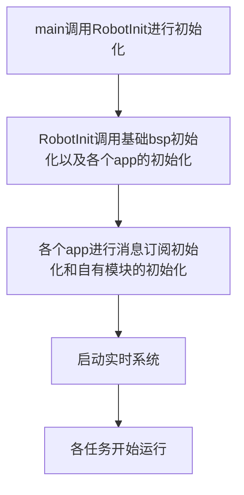
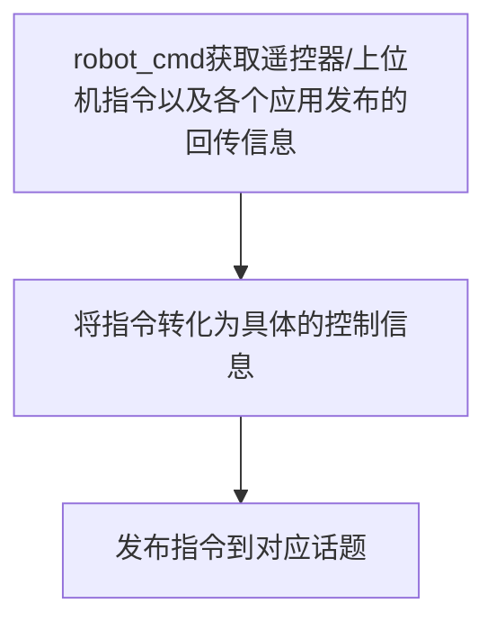

# application

neozng1@hnu.edu.cn

这是application层的说明。

> todo: 是否有必要将所有电机等模块的初始化参数放到一个头文件？

## 使用说明

在main函数中包含`robot.h`头文件，这是对整车的抽象。将`INStask`，`motortask`，`ledtask`，`monitortask`这四个task加入`freertos.c`中，创建对应的任务，设置合适的任务运行间隔；然后将`robottask`放入freertos.c中，同样以一定的频率运行。 在初始化实时系统之前，在`main()`中调用`RobotInit()`进行整车的初始化。

**关于运行的任务**，INStask的运行频率必须为1kHz，motortask推荐的运行频率为200Hz\~1000Hz（详情见module/motor/motor_task.c），在MotorTask内部，对于高实时性要求的电机可以提升到1kHz，不过要注意CAN总线的负载。monitortask的运行频率为100Hz；robottask的运行频率推荐为150Hz以上，应当高于视觉发送的频率，若后续使用插帧，同样应该保证不低过motortask太多。

若使用双板，则在`robot_def.h`中给对应的开发板设定宏定义，如底盘板使用`#define CHASSIS_BOARD`，云台板使用`#define GIMBAL_BOARD`；单个开发板控制整车，则定义`#define ONE_BOARD`。在每个应用中，都已经使用编译预处理指令完成条件编译，会自动根据设定的宏切换功能。使用双板的时候，目前板间通信通过CAN完成，因此两个开发板会挂载在一条总线上，在两个开发板对这条总线的其他使用CAN的设备进行配置时注意**不要发生ID冲突**，还要注意**防止负载过大**。

**同样，在该文件中你需要修改一些关于机器人的参数**。比如底盘和云台对齐时yaw电机编码器的值，拨盘的单圈载弹量、底盘的轴距等等。

## 封装总览

Robot.c是整个机器人的抽象，其下有4个应用：robot_cmd，gimbal，chassis，shoot。此框架当前是针对步兵/英雄/哨兵设计的，其他机器人只需要根据各自的特殊机构进行修改即可。robot_cmd是整个机器人的核心应用，其负责接受遥控器/上位机发来的指令，并将指令转化为实际的运动控制目标，发送给其他三个应用。后者会根据robot_cmd发来的命令，设定电机和其他执行单元的参考值等。

为了进一步解耦应用之间的关系，app层并没有module和bsp之间的那种层级结构（或设计模式中所谓的**结构类型模式**，即robot_cmd包含其他三个模块），而采用了应用并列的**发布-订阅**机制，四个应用之间没有任何相互包含关系，他们之间的通信通过module层提供的`message_center`实现。每个应用会通过该模块向一些话题（事件）发布一些消息，同时从一些话题订阅消息。如robot_cmd应用会发布其他三个模块的控制信息，同时订阅其他三个模块的反馈信息。其他三个模块会订阅robot_cmd发布的控制信息，同时发布反馈给robot_cmd的信息，他们不需要知道彼此的存在，只是从`message_center`处获取其他应用发布的消息或向自己发布的话题推送消息。

application在初始化module的时候，初始化参数会包含部分bsp的内容，但仅仅是外设和引脚的选择以及id设置（用于通信的外设需要id设置）。实际上当前框架的app层和cubemx初始化部分耦合，在配置的时候就必须确定每个外设的作用和归属权，一旦cubemx完成设置app层必须按照对应参数设置引脚和并分配module的外设。后续考虑将cubemx和bsp耦合，去除顶层代码和底层的关系

## 整车程序流程

任务开始之后，每个app之间的交互关系如下：

gimbal/chassis/shoot则根据订阅的robot_cmd发布的消息，将具体的控制信息根据当前模式转化为执行单元的目标值，通过自己拥有的模块完成这些指令，然后把回传的信息发布到对应话题。

每个应用的具体流程和实现，参见它们各自的说明文档。

## 开发要点

各个应用之间务必通过`message_center`以发布-订阅的方式进行消息交换，不要出现包含关系，这可以大大减小耦合度并提高合作开发的效率。
