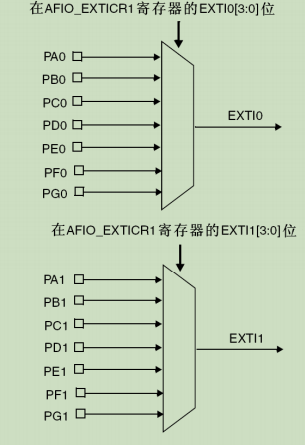
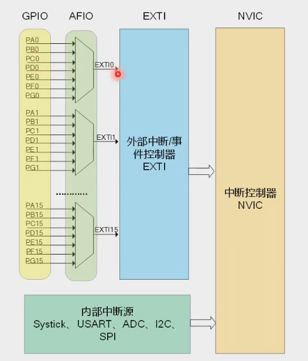

可以作为io接口,也可以处理外部中断.






使用示例

```c

GPIO_Init_Config_s gpio_init = {
    .exti_mode = GPIO_EXTI_MODE_FALLING, // 注意和CUBEMX的配置一致
    .GPIO_Pin = GPIO_PIN_6, // GPIO引脚
    .GPIOx = GPIOG, // GPIO外设
    .gpio_model_callback = NULL, // EXTI回调函数
},

GPIOInstance* test_example = GPIORegister(&gpio_init);
GPIOSet(test_example);
```