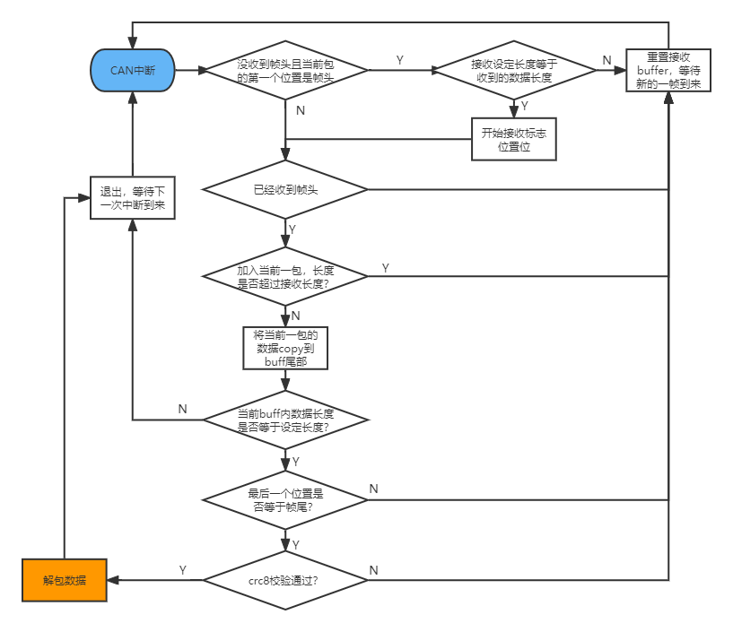

# can_comm

<p align='right'>neozng1@hnu.edu.cn</p>

> TODO:
>
> 1. 对`CANCommGet()`进行修改，使得其可以返回数据是否更新的相关信息。

## 重要提醒

如果传输过程中出现多次丢包或长度校验不通过，尤其是传输长度较大的时候，请开启CAN的Auto Retransmission，并尝试修改CANComm实例的发送和接受ID（以提高在总线仲裁中的优先级）。

## 总览和封装说明

CAN comm是用于CAN多机通信的模块。你不需要关心实现的协议，**只需要传入你想发送/接收的结构体的长度**（通过`sizeof()`获取）即可。单帧发送长度目前限制为60字节，如果需要加长可以在`can_comm.h`中修改`CAN_COMM_MAX_BUFFSIZE`的定义值。注意CAN的负载以及使用此模块的发送频率，否则可能造成堵塞。

## 代码结构

.h中放置的是数据定义和外部接口，以及协议的定义和宏，.c中包含一些私有函数。

## 外部接口

```c
CANCommInstance *CANCommInit(CANComm_Init_Config_s* comm_config);
void CANCommSend(CANCommInstance *instance, uint8_t *data);
void *CANCommGet(CANCommInstance *instance);
uint8_t CANCommIsOnline(CANCommInstance *instance);
```

第一个函数将会初始化一个CANComm实例，返回其指针。使用CANComm进行通信的应用应该保存返回的指针。初始化需要传入一个初始化结构体。请在应用初始化的时候调用该函数。推荐的结构体配置方式如下：

```c
/* 初始化结构体的定义 */
typedef struct
{
    can_instance_config_s can_config;
    uint8_t send_data_len; //发送数据长度
    uint8_t recv_data_len; //接收数据长度,两者请用sizeof获取
} CANComm_Init_Config_s;

CANComm_Init_Config_s cconfig = {
  .can_config = {
            .can_handle=&hcan1,
            .tx_id=0x02,
            .rx_id=0x03},
  .send_data_len = sizeof(your_data_structure),
  .recv_data_len = sizeof(recv_data_structure)
};
```

第二个函数将会通过CAN发送一帧数据。这里的“帧”不是CAN的一帧报文，而是你使用的数据。在CANComm初始化的时候，使用sizeof获得你要发送的数据的长度。调用此函数时，将你的数据结构或数据cast成`u8`类型的指针传入即可。==**特别注意，你的结构体需要使用预编译指令`#pragma pack(1)`以及`#pragma pack()`包裹**==，从而进行字节压缩而不进行字节对齐，如：

```c
#pragma pack(1)
typedef struct
{
    uint8_t aa;
    float bb;
    double cc;
    uint16_t dd;
} some_struct;
#pragma pack()
```

只有这样，这个结构体才不会进行padding扩充字节实现字节对齐。你可以尝试一下，如果不使用pack处理，上面的结构体将会占据18个字节以上的空间；开启pack后，会降低至15。更多关于字节对齐的内容，自行查询。

> 后期可能更新字节对齐和内存访问相关的教程。

`CANCommGet()`是获取来自CANComm接收到的数据的接口，返回值为一个void类型指针，你需要通过**强制类型转换**将其变为你设定的接收类型指针，然后就可以访问其数据了。

## 私有函数和变量

```c
static CANCommInstance *can_comm_instance[MX_CAN_COMM_COUNT] = {NULL};
static uint8_t idx; 
static void CANCommResetRx(CANCommInstance *ins);
static void CANCommRxCallback(can_instance *_instance);
```

第一个指针数组保存所有的can comm实例，从而在callback中区分不同实例。idx是初始化使用的索引，用于确定每个can comm实例指针存放的位置。

`CANCommResetRx()`在`CANCommRxCallback()`中多次被调用，用于清空接收缓冲区。

`CANCommRxCallback()`是CAN comm初始化can实例时的回调函数，用于can接收中断，进行协议解析。

## 使用范例

例如，这里要发送的数据是一个float，接收的数据是如下的`struct`，**==注意要使用pack==**：

```c
#pragma pack(1)
struct test
{
 float aa;
 float bb;
 float cc;
 uint16_t dd;
};
#pragma pack()
```

初始化时设置如下：

```c
CANComm_Init_Config_s cconfig = {
  .can_config = {
            .can_handle=&hcan1,
            .tx_id=0x02,
            .rx_id=0x03},
  .send_data_len = sizeof(float),
  .recv_data_len = sizeof(struct test)
};
CANCommInstance* ins = CANCommInit(&cconfig);
```

通过`CANCommGet()`并使用强制类型转换获得接收到的数据指针：

```c
struct test* data_ptr=(struct test*)CANCommGet(ins)
```

发送通过`CANCommSend()`，建议使用强制类型转换：

```c
float tx=114.514;
CANCommSend(ins, (uint8_t*)&tx);
```

## 接收解析流程

CAN comm的通信协议如下：

| 帧头        | 数据长度 | 数据             | crc8校验 | 帧尾        |
| ----------- | -------- | ---------------- | -------- | ----------- |
| 's'（0x73） | 0~255    | 最大60（可修改） | 校验码   | 'e'（0x65） |
| 1-byte      | 1-byte   | n-byte           | 1-byte   | 1-byte      |

接收的流程见代码注释。

流程图如下：
