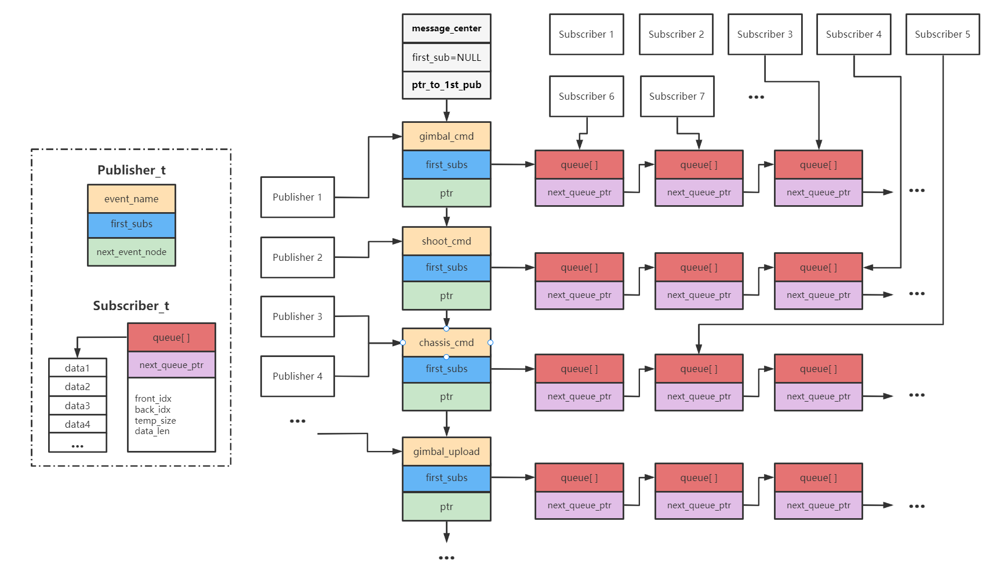
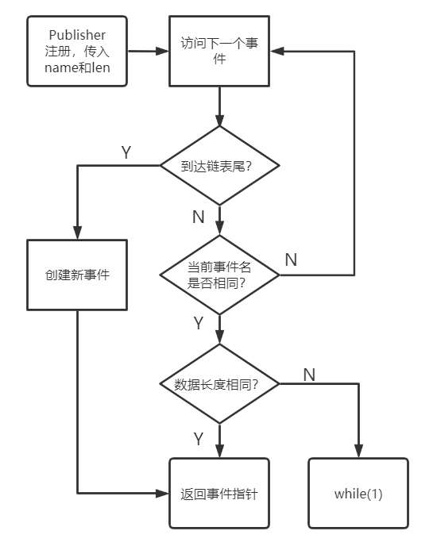
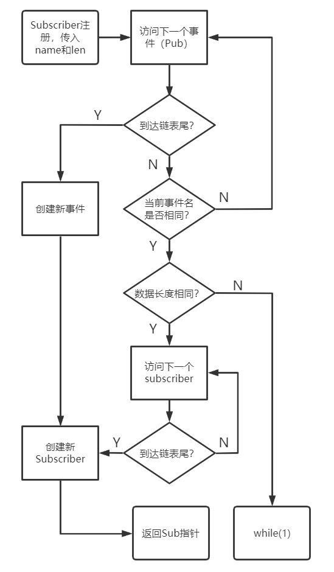
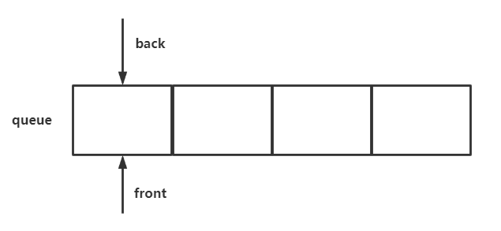

# message_center

<p align='right'>neozng1@hnu.edu.cn</p>

> TODO:
>
> 支持自定义队列长度，使得订阅者可以自行确定需要的队列长度，适应不同的需求

## 总览和封装说明

**重要定义：**

- 发布者：发布消息的对象。发布者会将自己的消息推送给所有订阅了某个特定**话题**的订阅者。
- 订阅者：获取消息的对象。订阅者在订阅了某个话题之后，可以通过接口获得该话题的消息。
- 话题（topic）：用于区分消息来源的对象。可以将一个话题看作一刊杂志，不同的发布者会将文章汇集到杂志上，而订阅者选择订阅一种杂志，然后就可以获取所有写在杂志上的文章。

Message Center不同应用间进行消息传递的中介，它的存在可以在相当大的程度上解耦不同的app，使得不同的应用之间**不存在包含关系**，让代码的自由度更大，将不同模块之间的关系降为**松耦合**。在以往，如果一个.c文件中的数据需要被其他任务/源文件共享，那么其他模块应该要包含前者的头文件，且头文件中应当存在获取该模块数据的接口（即函数，一般是返回数据指针或直接返回数据，**强烈建议不要使用全局变量**）；但现在，不同的应用之间完全隔离，他们不需要了解彼此的存在，而是只能看见一个**消息中心**以及一些**话题**。

需要被共享的消息，将会被**发布者**（publisher）发送到消息中心；要获取消息，则由**订阅者**（subscriber）从消息中心根据订阅的话题获取。在这之前，发布者要在消息中心完成**注册**，将自己要发布的消息类型和话题名称提交到消息中心；订阅者同样要先在消息中心完成订阅，将自己要接收的消息类型和话题名称提交到订阅中心。消息中心会根据**话题名称**，把订阅者绑定到发布相同名称的发布者上。

> 为了节省空间，数据结构上采用了链表+循环数组模拟队列的方式。C没有哈希表，因此让发布者保存所有订阅者的地址（实际上只保存首地址，然后通过链表访问所有订阅者）。

Message Center对外提供了四个接口，所有原本要进行信息交互的应用都应该包含`message_center.h`，并在初始化的时候进行注册。

## 代码结构

.h 文件中包含了外部接口和类型定义，.c中包含了各个接口的具体实现。

## 外部接口

**在代码实现上，话题名实际上就是通过一个字符串体现的。**

```c
Subscriber_t* SubRegister(char* name,uint8_t data_len);

Publisher_t* PubRegister(char* name,uint8_t data_len);

uint8_t SubGetMessage(Subscriber_t* sub,void* data_ptr);

void PubPushMessage(Publisher_t* pub,void* data_ptr);
```

### 订阅者

订阅者应该保存一个订阅者类型的指针`Subscriber_t*`，在初始化的时候调用`SubRegister()`并传入要订阅的话题名和该话题对应消息的长度，可以直接输入字符串，示例如下，将从event_name订阅float数据：

```c
Subscriber_t* my_sub;
my_sub=SubRegister("event_name",sizeof(float));
```

订阅完毕后，在应用中通过`SubGetMessage()`获取消息，调用时传入订阅时获得的指针，以及要存放数据的指针。在使用的时候，建议使用强制类型转换将`data_ptr` cast成void*类型（好习惯）。

如果消息队列中有消息，返回值为1；否则，返回值为0，说明没有新的消息可用。

### 发布者

发布者应该保存一个发布者类型的指针，在初始化的时候传入要发布的话题名和该话题对应的消息长度。

完成注册后，通过`PubPushMessage()`发布新的消息。所有订阅了该话题的订阅者都会收到新的消息推送。

### 可修改的宏

```c
#define MAX_EVENT_NAME_LEN  32  //最大的话题名长度,每个话题都由字符串来命名
#define QUEUE_SIZE 1            //消息队列的长度
```

修改第一个可以扩大话题名长度，第二个确定消息队列的长度，数量越大可以保存的消息越多。

## 私有函数和定义

```c
static Publisher_t message_center = {
    .event_name = "Message_Manager",
    .first_subs = NULL,
    .next_event_node = NULL};

static void CheckName(char* name)
{
    if(strnlen(name,MAX_EVENT_NAME_LEN+1)>=MAX_EVENT_NAME_LEN)
    {
        while (1); // 进入这里说明话题名超出长度限制
    }
}
```

`message_center`内部保存了指向第一个发布者的指针，可以看作整个消息中心的抽象。通过这个变量，可以访问所有发布者和订阅者。它将会在各个函数中作为dumb_head（哑结点）以简化逻辑，这样不需要对链表头进行特殊处理。

`CheckName()`在发布者/订阅者注册的时候被调用，用于检查话题名是否超过长度限制。超长后会进入死循环，方便开发者检查。

> 四个外部接口的实现都有详细的注释，有兴趣的同学可以自行阅读。下方也提供了流程图。

## 注册、发布、获取消息流程

包含一个结构图和四个流程图。

### Message Center的结构

<center>建议打开原图查看</center>

**多个publisher可以绑定同一个话题，往该话题推送消息。但一个subscriber只能订阅一个话题，如果应用需要订阅多个话题，则要创建对应数量的订阅者。**

> 对于电控程序目前的情况，不存在多个publisher向同一个话题推送消息的情况。

**对于相同话题，其消息长度必须相同**。发布者和订阅者在注册时都会传入消息长度，用`sizof(your_data)`获取。应当保证不同的模块在进行交互式，使用相同的数据长度。

### 发布者和订阅者注册的流程

- **发布者：**

  遍历发布者的话题结点，如果发现相同的话题，直接返回指针即可；遍历完成后发现尚未创建则创建新的话题。



- **订阅者：**

  需要注意，由于不同应用/模块的初始化顺序不同，可能出现订阅者先于发布者订阅某一消息的情况，所以要进行发布者链表的遍历，判断是否已经存在相同话题名的发布者，不存在则要先创建发布者结点再将新建订阅者结点并挂载到前者上。



### 推送/获取消息的流程

- **数组+头尾索引模拟队列**



front指向队列头，即最早入队的数据；back指向队列尾，即最新的数据。队列是first in first out（FIFO，先进先出）的结构。back指向的位置是入队数据被写入的位置，front指向的是读取时会出队的位置。当有数据入队，back++；出队则front++。若碰到数组边界，则返回数组头，可以通过取模实现：

```C
idx=(idx+1)%SIZE_OF_ARRAY; //SIZE_OF_ARRAY是数组大小
```

我们还需要一个变量用于保存当前队列的元素个数，如果在写入时，队列长度等于上限，应该先将最老的数据出队，再写入新的数据，即：

```c
back=(back+1)%SIZE_OF_ARRAY;
size--;
queue[front]=new_data;
front=(front+1)%SIZE_OF_ARRAY;
```

- **发布者推送消息到指定话题**

通过发布者指针，将订阅了该话题的所有订阅者遍历，将新数据入队。

- **订阅者获取消息**

从订阅者指针访问消息队列，取出最先进入队列的数据。注意判断队列是否为空，如果为空则返回0。

## 示例代码

```c
typedef struct 
{
    float a;
    uint8_t b;
    uint32_t c;
}good;

good g1;
good g2;
good pub_data={.a=1,.b=2,.c=3};
// 一个发布者,两个订阅者
Subscriber_t* s=SubRegister("test",sizeof(good));
Subscriber_t* ss=SubRegister("test",sizeof(good));
Publisher_t* p=PubRegister("test",sizeof(good));
// 推送消息
PubPushMessage(p,&pub_data);
pub_data.a=4;
pub_data.b=5;
pub_data.c=6;
// 推送新消息
PubPushMessage(p,&pub_data);
volatile uint8_t d= 0; // 确定收到的消息是否有效,可以根据d的值进一步处理
d=SubGetMessage(s,&g1);
d=SubGetMessage(s,&g1);
d=SubGetMessage(s,&g1); // 此时d等于0
d=SubGetMessage(ss,&g2);
```
